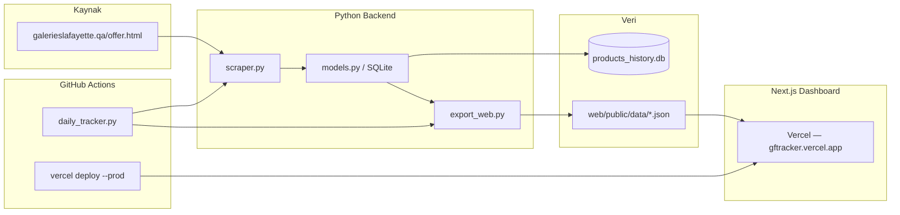

# GFTracker — Sistem Dokümantasyonu

Galeries Lafayette Qatar (`galerieslafayette.qa/offer.html`) indirimli ürünlerini günlük olarak tarayan, fiyat geçmişini SQLite'ta saklayan ve Next.js dashboard üzerinden sunan bir fiyat takip sistemidir.

**Canlı site:** https://gftracker.vercel.app  
**Kaynak kod:** https://github.com/mustafaozcaninfo/gftracker

---

## Ne yapar?

1. **Scrape** — Offer sayfasının tüm sayfalarını (~152 sayfa, ~4800+ ürün) tarar.
2. **Kayıt** — Her ürünün günlük fiyatını veritabanına yazar; günler arası değişimleri loglar.
3. **Analiz** — En iyi indirimleri, fiyat değişimlerini ve “alım sinyali” (tarihsel dip fiyata yakın ürünleri) hesaplar.
4. **Dashboard** — Sonuçları mobil uyumlu bir web arayüzünde gösterir.
5. **Otomasyon** — GitHub Actions her gün scrape + deploy çalıştırır.

---

## Genel mimari



---

## Proje yapısı

```
GFTracker/
├── config.yaml              # Scraper ve çıktı ayarları
├── scraper.py               # HTTP scrape + HTML/JSON parse
├── models.py                # SQLite şeması ve iş mantığı
├── main.py                  # Scrape orkestrasyonu
├── export_web.py            # Dashboard JSON export
├── tracker.py               # CLI (update / report / export-web)
├── daily_tracker.py         # Cron + GitHub Actions giriş noktası
├── backfill_images.py       # Sadece ürün görsellerini günceller
├── run_full_scrape.py       # Tam scrape + ara checkpoint export
├── requirements.txt
├── data/
│   ├── products_history.db  # SQLite (gitignore — local/CI'da oluşur)
│   └── daily_snapshot_*.json
├── web/                     # Next.js 15 dashboard
│   ├── app/                 # Sayfa rotaları
│   ├── components/          # UI bileşenleri
│   └── public/data/         # Export edilen JSON dosyaları
├── .github/workflows/
│   └── daily-tracker.yml    # Günlük scrape + Vercel deploy
└── vercel.json              # Monorepo Vercel yapılandırması
```

---

## Scraper nasıl çalışır?

**Hedef:** `https://www.galerieslafayette.qa/offer.html`

| Sayfa | İstek tipi | İçerik |
|-------|-----------|--------|
| Sayfa 1 | Tam HTML | Ürün listesi + toplam sayfa sayısı (`k-page-count`) |
| Sayfa 2+ | `is_scroll=1` ile AJAX | JSON içinde `categoryProducts` |

**`scraper.py` özellikleri:**
- Rastgele `User-Agent`, gecikme ve retry (stealth / normal / turbo modları)
- Sayfa başına ~32 ürün parse eder (isim, marka, fiyat, indirim %, SKU, URL, görsel)
- `config.yaml` → `speed: turbo` ile ~152 sayfa birkaç dakikada tamamlanır

**Incremental kayıt:** Her sayfa scrape edildikten hemen sonra veritabanına yazılır. Scrape yarıda kesilse bile o ana kadar toplanan ürünler kaybolmaz.

---

## Veritabanı (SQLite v2)

Dosya: `data/products_history.db` (git'e **dahil değil**)

| Tablo | Açıklama |
|-------|----------|
| `products` | Ürün kataloğu (product_id, marka, URL, ilk/son görülme) |
| `daily_prices` | Ürün başına gün başına bir fiyat satırı (aynı gün tekrar scrape → UPSERT) |
| `price_changes` | Günler arası fiyat/indirim değişim logu |
| `scrape_runs` | Her scrape oturumunun durumu (running / completed / failed) |

### Buy Signal (alım sinyali)

Bir ürün şu koşullarda “buy signal” sayılır:
- Tarihsel **en düşük fiyatta** (`is_at_lowest`), veya
- En düşük fiyata **%2 veya daha az** yakınsa (`pct_above_lowest ≤ 2`)

Bu mantık birden fazla gün veri biriktikçe anlamlı hale gelir.

### Best Deals

O günkü en yüksek indirim yüzdesine sahip ürünler (varsayılan: top 20).

---

## Web dashboard

**Stack:** Next.js 15 (App Router), Tailwind CSS, Vercel'de host.

### Sayfalar

| Rota | İçerik | Veri kaynağı |
|------|--------|--------------|
| `/` | Genel özet, istatistik kartları | `meta.json` |
| `/best-deals` | En iyi 20 indirim | `best_deals.json` |
| `/buy-signals` | Alım sinyali ürünleri (sayfalama) | `buy_signals.json` |
| `/products` | Tüm katalog (filtre + lazy image) | `products.json` |
| `/price-changes` | Son fiyat değişimleri | `price_changes.json` |

JSON dosyaları bilinçli olarak **parçalı** tutulur (~8 MB tek dosya yerine sayfa başına küçük dosyalar → tarayıcı donması önlenir).

### Mobil uyumluluk

- Kaydırılabilir navigasyon, 44px dokunma alanları
- Küçük ekranda kart layout, büyük ekranda tablo
- 320px ve üzeri viewport desteği

---

## Veri akışı

```
Scrape (152 sayfa)
    ↓
SQLite'a yaz (sayfa sayfa)
    ↓
export_web.py → web/public/data/*.json
    ↓
next build (JSON public/ altından statik servis edilir)
    ↓
Vercel production deploy
```

---

## Deploy yolları

Sistemde **iki bağımsız deploy kanalı** vardır:

### 1. Git push → Vercel Git entegrasyonu

`main` branch'e push yapıldığında Vercel otomatik build alır. Bu yol **scrape çalıştırmaz** — repodaki mevcut JSON ile deploy eder. UI/kod değişiklikleri için uygundur.

### 2. GitHub Actions → `vercel deploy --prod`

`.github/workflows/daily-tracker.yml` workflow'u:

1. Repoyu checkout eder
2. `python daily_tracker.py` — tam scrape + JSON export
3. `npm ci && npm run build` (`web/` içinde)
4. Vercel CLI ile production deploy

**Tetikleyiciler:**
- Cron: her gün **06:00 Qatar saati** (03:00 UTC)
- Manuel: Actions sekmesinden `workflow_dispatch`

**Gerekli secret:** `VERCEL_TOKEN`

### 3. Local deploy (manuel)

```bash
python tracker.py --export-web
cd web && npx vercel deploy --prod --yes --scope mst4fa-6141s-projects
```

Local DB'deki güncel veriyi canlıya almak için kullanılır.

---

## Local vs GitHub Actions farkı

| | Local (Mac) | GitHub Actions |
|---|-------------|----------------|
| Kaynak kod | Aynı (`main` branch) | Aynı |
| SQLite DB | Kalıcı, günler birikir | Her run **sıfırdan** başlar |
| `days_tracked` | Artar | İlk günlerde `1` kalır |
| Buy signal kalitesi | Zamanla iyileşir | DB cache olmadan sınırlı |

> **Not:** Actions'ta DB'nin run'lar arası korunması için henüz artifact/cache eklenmemiştir. Uzun vadeli fiyat geçmişi için bu iyileştirme planlanabilir.

---

## Komutlar

### Kurulum

```bash
python -m venv .venv
source .venv/bin/activate
pip install -r requirements.txt
cd web && npm ci
```

### Günlük kullanım

```bash
# Tam scrape + DB güncelle + JSON export
python tracker.py --update

# Sadece mevcut DB'den JSON export (scrape yok)
python tracker.py --export-web

# Terminal raporu
python tracker.py --report

# Sadece görselleri güncelle
python backfill_images.py
```

`daily_tracker.py` = `tracker.py --update` ile aynı scrape/export mantığı (Actions'ın kullandığı entry point).

### Web geliştirme

```bash
cd web
npm run dev    # http://localhost:3000
```

---

## Yapılandırma (`config.yaml`)

```yaml
base_url: "https://www.galerieslafayette.qa"
offer_path: "/offer.html"
max_pages: 0              # 0 = otomatik (152 sayfa)
discounted_only: false    # false = tüm offer ürünleri

output:
  db_path: "data/products_history.db"

scraper:
  speed: turbo              # stealth | normal | turbo
```

---

## GitHub Actions workflow özeti

```yaml
on:
  schedule: "0 3 * * *"    # 06:00 Qatar
  workflow_dispatch:       # Manuel tetikleme

steps:
  - checkout
  - pip install -r requirements.txt
  - python daily_tracker.py      # ~5–18 dk
  - npm ci && npm run build        # web/
  - vercel deploy --prod           # web/
```

Timeout: 45 dakika.

---

## Özet

| Bileşen | Teknoloji | Rol |
|---------|-----------|-----|
| Scraper | Python + requests + BeautifulSoup | Offer sayfasından ürün çekme |
| Depolama | SQLite | Fiyat geçmişi ve analitik |
| Export | Python → JSON | Web UI besleme |
| Dashboard | Next.js + Tailwind | Kullanıcı arayüzü |
| Hosting | Vercel | Production deploy |
| Otomasyon | GitHub Actions | Günlük scrape + deploy |

GFTracker, indirimli ürünleri sistematik olarak izleyip **“bugün alınır mı?”** sorusuna veriyle cevap vermek için tasarlanmıştır. Kod değişiklikleri push ile, veri güncellemeleri ise scrape + deploy ile canlıya gider.
