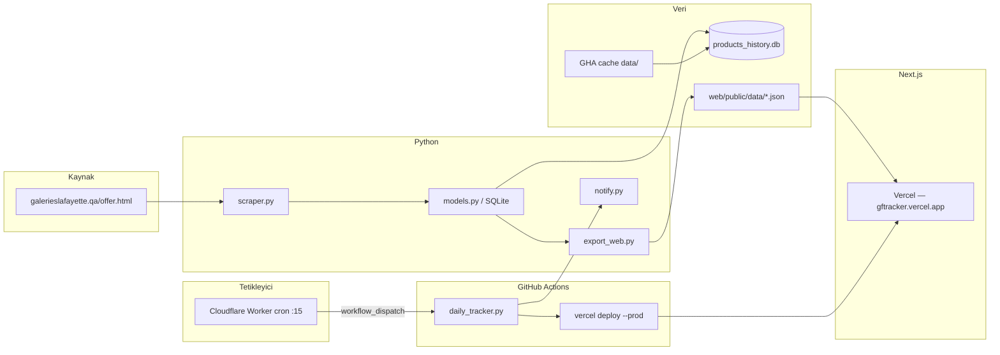

# GFTracker — Sistem Dokümantasyonu

Galeries Lafayette Qatar (`galerieslafayette.qa/offer.html`) indirimli ürünlerini **saatlik** tarayan, fiyat geçmişini SQLite'ta saklayan ve Next.js dashboard üzerinden sunan bir fiyat takip sistemidir.

**Canlı site:** https://gftracker.vercel.app  
**Kaynak kod:** https://github.com/mustafaozcaninfo/gftracker  
**Kısa başlangıç:** [README.md](./README.md)

---

## Ne yapar?

1. **Scrape** — Offer sayfasının tüm sayfalarını (~152 sayfa, ~4800 ürün) tarar.
2. **Kayıt** — Qatar takvim günü başına fiyat (UPSERT); intraday fiyat hareketlerini loglar.
3. **Sold/gone** — Tam scrape sonrası önceki katalog snapshot'ı ile diff; kayıp ürünleri `is_active=0`.
4. **Analiz** — En iyi indirimler, fiyat düşüşleri, buy signal (tarihsel dip ±%2).
5. **Dashboard** — Parçalı JSON + Next.js 15 (mobil uyumlu).
6. **Otomasyon** — Cloudflare Worker (saatlik) → GitHub Actions → scrape + deploy.

---

## Genel mimari



---

## Proje yapısı

```
GFTracker/
├── config.yaml
├── scraper.py, models.py, main.py, export_web.py
├── daily_tracker.py          # CI entry (scrape → validate → notify)
├── tracker.py                # CLI (--update / --report / --export-web)
├── run_full_scrape.py        # Checkpoint'li tam scrape
├── notify.py
├── tests/                    # Python unit tests
├── data/                     # SQLite + snapshots (DB gitignore)
├── web/                      # Next.js 15 dashboard
│   ├── app/                  # App Router sayfaları
│   ├── components/
│   ├── lib/
│   └── public/data/          # Export JSON
├── workers/github-cron/      # Cloudflare → GitHub dispatch
└── .github/workflows/
    ├── daily-tracker.yml     # Saatlik scrape + deploy
    └── ci.yml                # PR: test + build
```

---

## Scraper

**Hedef:** `https://www.galerieslafayette.qa/offer.html`

| Sayfa | İstek | İçerik |
|-------|-------|--------|
| 1 | Tam HTML | Ürün listesi + `k-page-count` |
| 2+ | `is_scroll=1` AJAX | JSON `categoryProducts` |

- `scraper.py`: User-Agent rotasyonu, retry, `stealth | normal | turbo`
- Bedenler: Magento `jsonConfig` — yalnızca stokta olan child SKU'lar
- Her sayfa sonrası DB'ye incremental yazım (`record_daily_scrape`)

---

## Veritabanı (SQLite v2)

Dosya: `data/products_history.db` (git'e dahil değil; GHA **cache** ile run'lar arası korunur)

| Tablo | Açıklama |
|-------|----------|
| `products` | Katalog; `is_active`, `removed_at`, sizes, gender |
| `daily_prices` | Ürün × Qatar günü (UPSERT aynı gün) |
| `price_changes` | Ürün × gün tek satır; intraday güncellenir |
| `scrape_runs` | Oturum + `catalog_snapshot` JSON (tam scrape) |

### Sold / gone

Tam scrape (`scrape_complete`) sonrası:

1. Önceki tamamlanmış run'ın `catalog_snapshot`'ı alınır (yoksa aktif DB bootstrap).
2. `previous_ids - current_ids` → `is_active=0`, `removed_at` set.
3. Kısmi scrape'te catalog diff **atlanır** (deploy da atlanır).

Son 24/48 saat sold sayımları **Asia/Qatar** cutoff ile hesaplanır.

### Buy signal

- `min_days_tracked >= 2`
- Fiyat varyasyonu geçmişi var
- `is_at_lowest` veya `pct_above_lowest ≤ 2`

---

## Web dashboard

**Stack:** Next.js 15, Tailwind, Vercel.

| Rota | İçerik | JSON |
|------|--------|------|
| `/` | Overview, stats | `meta.json` |
| `/best-deals` | En yüksek indirim % | `best_deals.json` |
| `/buy-signals` | Dip fiyata yakın | `buy_signals.json` |
| `/biggest-drops` | En büyük QAR düşüşler | `biggest_drops.json` |
| `/price-changes` | Tüm değişimler | `price_changes.json` |
| `/products` | Katalog + filtre | `products.json` (shared client fetch) |
| `/products/[id]` | Ürün detay (SSR) | server `loadProductDetail` |
| `/brands`, `/sizes` | Keşif | `brand_stats.json`, `products.json` |
| `/sold` | Satılan / kalkmış | `sold_products.json` |
| `/compare`, `/my-list` | Araçlar | localStorage + catalog |

`products.json` ~3–4 MB — `catalog-client.ts` ile tek fetch paylaşılır.

Monolithic `dashboard.json` artık üretilmez; web yalnızca parçalı `web/public/data/*.json` dosyalarını kullanır.

---

## Veri akışı (production)

```
Cloudflare cron (UTC :15)
  → workflow_dispatch daily-tracker.yml
      → restore GHA cache (data/)
      → python daily_tracker.py
          → scrape (152 sayfa)
          → scrape_complete? → export_web + validate_export
          → kısmi? → exit 2, notify, deploy YOK
      → save GHA cache
      → npm ci && npm run build && vercel deploy --prod
```

`vercel.json` → `"ignoreCommand": "exit 0"` — Vercel Git push deploy **kapalı**; veri her zaman Actions üzerinden gelir.

---

## Deploy yolları

| Yol | Ne zaman | Scrape |
|-----|----------|--------|
| GitHub Actions `daily-tracker.yml` | Saatlik / manuel dispatch | Evet |
| `vercel deploy` local | Acil / debug | Hayır (mevcut JSON) |
| Vercel Git integration | Devre dışı (`ignoreCommand`) | — |

**Gerekli GitHub secrets:** `VERCEL_TOKEN`, isteğe bağlı `TELEGRAM_*`, `DISCORD_WEBHOOK_URL`

**Cloudflare Worker secrets:** `GITHUB_PAT` — bkz. [workers/github-cron/README.md](./workers/github-cron/README.md)

---

## Local vs GitHub Actions

| | Local | GitHub Actions |
|---|-------|----------------|
| SQLite | Kalıcı | `actions/cache` ile korunur |
| `days_tracked` | Birikir | Cache ile birikir |
| Deploy | Manuel Vercel CLI | Otomatik (tam scrape sonrası) |
| Bildirim | `.env` ile opsiyonel | Secrets |

---

## Komutlar

```bash
# Kurulum
python -m venv .venv && source .venv/bin/activate
pip install -r requirements.txt
cd web && npm ci

# Scrape + export
python daily_tracker.py
python tracker.py --update
python tracker.py --export-web
python tracker.py --report

# Test
python -m unittest discover -s tests
cd web && npm test && npm run build

# Web dev
cd web && npm run dev
```

---

## Yapılandırma (`config.yaml`)

```yaml
max_pages: 0              # 0 = otomatik (~152)
discounted_only: false
output:
  db_path: "data/products_history.db"
scraper:
  speed: turbo            # stealth | normal | turbo
```

---

## GitHub Actions özeti

### `daily-tracker.yml`

- **Tetikleyici:** `workflow_dispatch`, `repository_dispatch` (`hourly-scrape`)
- **Timeout:** 50 dk
- **Cache:** `gftracker-data-v2-*` → `data/`
- **Deploy:** yalnızca `daily_tracker.py` exit 0 (tam scrape)

### `ci.yml`

- **Tetikleyici:** PR + push `main`
- Python import smoke + `tests/`
- `web`: `npm test`, `npm run build`

---

## Özet

| Bileşen | Teknoloji |
|---------|-----------|
| Scraper | Python, requests, BeautifulSoup |
| Depolama | SQLite (WAL) + GHA cache |
| Export | Parçalı JSON + `validate_export` |
| UI | Next.js 15 + Tailwind |
| Hosting | Vercel (CLI deploy) |
| Cron | Cloudflare Worker → GitHub |
| Bildirim | Telegram / Discord (opsiyonel) |

GFTracker, offer sayfasındaki ürünleri sistematik izleyip **“şimdi alınır mı?”** sorusuna veriyle cevap vermek için tasarlanmıştır.
